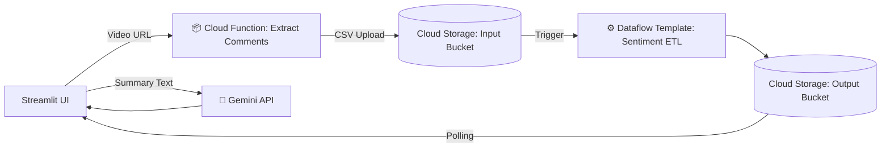

# 🎬 Real-Time YouTube Sentiment Analysis Dashboard

A cloud-powered, full-stack platform that enables users to search YouTube videos, extract and analyze multilingual comments (English, Hindi, Hinglish), perform real-time sentiment analysis using Google Cloud Platform, and generate detailed AI-powered insights via Gemini AI. The user interface is crafted in Streamlit for maximum responsiveness and accessibility.

## 📌 Features

* 🔍 Seamless YouTube video search by keyword
* 📅 Fast extraction of video comments (supports EN, HI, Hinglish)
* 🌐 Multilingual comment processing
* ☁️ Serverless, scalable sentiment analysis pipeline (Google Cloud Functions + Dataflow)
* 🤖 Automated insights and recommendations powered by Gemini AI
* 🌈 YouTube-inspired, modern, and responsive Streamlit UI
* 🔄 Download analysis results in TXT, JSON, PDF
* 🔒 Integrated GCP IAM roles and secure secrets handling

## ⚙️ Architecture Overview


```mermaid
graph LR
    UI[Streamlit UI]
    UI -->|Video URL| CF1[📦 Cloud Function: Extract Comments]
    CF1 -->|CSV Upload| GCS1[(Cloud Storage: Input Bucket)]
    GCS1 -->|Trigger| Dataflow[⚙️ Dataflow Template: Sentiment ETL]
    Dataflow --> GCS2[(Cloud Storage: Output Bucket)]
    GCS2 -->|Polling| UI
    UI -->|Summary Text| Gemini[🤖 Gemini API]
    Gemini --> UI
```

## 🧰 Technologies Used

| Layer         | Tools/Services                                  |
| ------------- | ----------------------------------------------- |
| Frontend      | Streamlit, HTML/CSS                             |
| Backend       | Python, Google Cloud Functions                  |
| Data Pipeline | Google Cloud Dataflow (Apache Beam)             |
| Storage       | Google Cloud Storage                            |
| Messaging     | Google Cloud Pub/Sub (optional)                 |
| AI Analysis   | Gemini Pro via `google.generativeai` SDK        |
| APIs          | YouTube Data API v3                             |

## 💻 Streamlit UI Overview

### `main.py` Key Functions:

- `init_state()`: Sets up session state.
- `show_header()`: YouTube-inspired header.
- `show_search()`: Search videos using YouTube Data API.
- `show_results()`: List search results, enable video selection.
- `show_selected()`: Trigger Cloud Function for comment extraction and poll results.
- `show_summary_and_insights()`: Display sentiment summary, use Gemini AI for advanced analysis.
- `show_downloads()`: TXT, JSON, PDF export support.
- `main()`: Orchestrates app logic and interface.

**Notes:**
- All configuration safely handled with `.env` or Streamlit `st.secrets`.
- Custom CSS for perfect UI and button alignment.

## 🧠 Google Gemini AI Integration

- **SDK:** `google.generativeai`
- **Model:** `gemini-pro`
- **Input:** Sentiment summary text file (from Dataflow job)
- **Output:** Markdown-formatted sectioned insights with:
  - Overall sentiment trends
  - Positive/negative/neutral breakdowns
  - Frequent viewer feedback
  - Actionable content improvement suggestions

## ☁️ Cloud Functions & Dataflow Pipeline

### Cloud Function: `extract_comments`

**Purpose:**  
Triggered by Streamlit. Receives a YouTube video URL and:
1. Fetches top-level comments with YouTube Data API v3.
2. Cleans and pre-processes (dedupes, filters, optional translation).
3. Writes CSV to GCS input bucket.

**Request Example:**
```json
{ "video_url": "https://www.youtube.com/watch?v=abc123" }
```
**CSV Output:**  
`VIDEO_ID_timestamp.csv` → `youtube-comments-input`

### Dataflow Job (sentiment ETL)

1. Automatically triggered by new CSV in the input bucket.
2. Reads comments, executes sentiment analysis (TextBlob, VADER, or ML/DL model).
3. Summarizes and formats results.
4. Exports as `.txt` to the output bucket (`youtube-sentiment-results`).

## 📦 Cloud Storage Buckets

| Bucket Name                 | Purpose                        |
|-----------------------------|--------------------------------|
| `youtube-comments-input`    | Raw comment CSVs from Function |
| `youtube-sentiment-results` | Output sentiment summaries     |

## 🔑 Secrets & Config (`.env` or Streamlit `st.secrets`)

```ini
GEMINI_API_KEY=your-gemini-api-key
YOUTUBE_API_KEY=your-youtube-data-api-key
COMMENTS_FUNC_URL=https://your-cloud-function-url
RESULTS_BUCKET=youtube-sentiment-results
GOOGLE_APPLICATION_CREDENTIALS=your-gcp-creds.json
```

## 🚀 Deployment Guide

### ✅ Prerequisites

- GCP project (w/ billing)
- Enabled: YouTube Data API, Cloud Functions, Dataflow, Storage
- Google Cloud SDK setup
- Adequate IAM Roles

### 🏗️ Step-by-Step Setup

#### 1. Clone the Repo

```bash
git clone https://github.com/saket0187/real-time-youtube-sentiment-analysis.git
cd yt-sentiment-dashboard
```

#### 2. Set Up Python Environment

```bash
python -m venv venv
source venv/bin/activate  # or venv\Scripts\activate on Windows
pip install -r requirements.txt
```

#### 3. Deploy Cloud Function

```bash
gcloud functions deploy extract_comments \
  --runtime python310 \
  --trigger-http \
  --allow-unauthenticated \
  --entry-point main \
  --source ./cloud_function/
```

#### 4. Deploy Dataflow Job

```bash
python sentiment_etl.py \
  --input gs://youtube-comments-input/VIDEO_ID.csv \
  --output gs://youtube-sentiment-results/VIDEO_ID_summary.txt \
  --runner DataflowRunner \
  --project your-project-id \
  --temp_location gs://your-temp-location/
```

#### 5. Run Streamlit App

```bash
streamlit run main.py
```

## 🚙 Future Improvements

- User authentication (Firebase)
- Natural language Q&A with Dialogflow
- BigQuery integration for multi-video analytics
- More languages & advanced NLP

## 📄 License

MIT License. See `LICENSE`.

## 🙏 Acknowledgments

- Google Cloud Platform
- YouTube Data API
- Gemini by Google
- Streamlit Community
