# 🎮 Real-Time YouTube Sentiment Analysis Dashboard

A cloud-based, full-stack system that allows users to search YouTube videos, extract multilingual comments (English, Hindi, Hinglish), perform real-time sentiment analysis using Google Cloud Platform services, and generate AI-powered insights using Gemini AI. The UI is built in Streamlit for interactivity and ease of use.

---

## 📌 Features

* 🔍 Search YouTube videos using keywords
* 📅 Extract comments from selected video
* 🌐 Handle multilingual comments (EN, HI, HINGLISH)
* 🔁 Serverless sentiment processing pipeline (Cloud Functions + Dataflow)
* 📊 Gemini-powered insights generation
* 🌈 Beautiful, responsive Streamlit UI with YouTube-themed design
* ☁️ Fully integrated with GCP (Cloud Storage, Pub/Sub, Functions, Dataflow)

---

## ⚙️ Architecture Overview

```mermaid
graph LR
    UI[Streamlit UI]
    UI -->|Video URL| CF1[📦 Cloud Function: Extract Comments]
    CF1 -->|CSV Upload| GCS1[(Cloud Storage: Input Bucket)]
    GCS1 -->|Trigger| Dataflow[⚙️ Dataflow Template: Sentiment ETL]
    Dataflow --> GCS2[(Cloud Storage: Output Bucket)]
    GCS2 -->|Polling| UI
    UI -->|Summary Text| Gemini[🤖 Gemini API]
    Gemini --> UI
```



---

## 🧰 Technologies Used

| Layer         | Tools/Services                                  |
| ------------- | ----------------------------------------------- |
| Frontend      | Streamlit, HTML/CSS                             |
| Backend       | Python, Google Cloud Functions                  |
| Data Pipeline | Google Cloud Dataflow (Apache Beam)             |
| Storage       | Google Cloud Storage                            |
| Messaging     | Google Cloud Pub/Sub (Optional variant)         |
| AI Analysis   | Google Gemini Pro via `google.generativeai` SDK |
| APIs          | YouTube Data API v3                             |

---

## 💽 Streamlit UI Overview

### `main.py`

#### Functions:

* `init_state()`: Initializes Streamlit session state for tabs, selected video, and summaries.
* `show_header()`: Renders the YouTube-themed header.
* `show_search()`: Lets users search YouTube via keyword using the YouTube Data API.
* `show_results()`: Displays video thumbnails, titles, and allows video selection.
* `show_selected()`: Triggers the Cloud Function with selected video URL and polls Cloud Storage for comment summaries.
* `show_summary_and_insights()`: Displays raw text summary and uses Gemini to generate AI-based sentiment insights.
* `main()`: Orchestrates the app across 2 tabs (search & analyze).

#### Notes:

* Uses `.env` or `st.secrets` for API keys.
* Applies custom CSS for theming.

---

## 🧐 Google Gemini AI Integration

### `google.generativeai`

* Initializes with `genai.configure(api_key=...)`
* Model: `gemini-pro`
* Input: Raw comment summary
* Output: Structured sentiment insight with sections like:

  * Overall sentiment
  * Positive themes
  * Negative themes
  * Recurring feedback
  * Recommendations

---

## ☁️ Cloud Function: `extract_comments`

### Purpose:

Triggered by the Streamlit app. Takes a YouTube video URL and:

1. Extracts top-level comments using YouTube Data API.
2. Cleans and preprocesses comments.
3. Writes them as a CSV file to a Cloud Storage bucket.

### Input:

```json
{ "video_url": "https://www.youtube.com/watch?v=abc123" }
```

### Output:

Uploads: `VIDEO_ID_timestamp.csv` to `INPUT_BUCKET`

---

### Technologies:

* Python
* GCP

### Steps:

1. **Read CSV** from GCS uploaded by the Cloud Function.
2. **Translate** non-English comments (optional).
3. **Run Sentiment Analysis** (e.g., TextBlob, VADER, ML/DL model).
4. **Summarize** major sentiments, trends.
5. **Write** cleaned summary `.txt` file to output GCS bucket.

---

## 📁 Cloud Storage Buckets

| Bucket Name                 | Purpose                 |
| --------------------------- | ----------------------- |
| `youtube-comments-input`    | Holds raw CSVs from CF  |
| `youtube-sentiment-results` | Stores `.txt` summaries |

---

## 🔐 Secrets & Config (.env / Streamlit Secrets)

```ini
GEMINI_API_KEY=your-gemini-api-key
YOUTUBE_API_KEY=your-youtube-data-api-key
COMMENTS_FUNC_URL=https://your-cloud-function-url
RESULTS_BUCKET=youtube-sentiment-results
GOOGLE_APPLICATION_CREDENTIALS=your-gcp-creds.json
```

---

## 🚀 Deployment Guide

### ✅ Prerequisites

* GCP Project with billing enabled
* YouTube Data API enabled
* Google Cloud SDK installed
* IAM Roles: Cloud Functions Invoker, Storage Admin, Dataflow Developer

---

### 🏗️ Step-by-Step Setup

#### 1. Clone the Repo

```bash
git clone https://github.com/yourusername/yt-sentiment-dashboard.git
cd yt-sentiment-dashboard
```

#### 2. Set Up Environment

```bash
python -m venv venv
source venv/bin/activate  # or venv\Scripts\activate on Windows
pip install -r requirements.txt
```

#### 3. Deploy Cloud Function

```bash
gcloud functions deploy extract_comments \
  --runtime python310 \
  --trigger-http \
  --allow-unauthenticated \
  --entry-point main \
  --source ./cloud_function/
```

#### 4. Deploy Dataflow Job

```bash
python sentiment_etl.py \
  --input gs://youtube-comments-input/VIDEO_ID.csv \
  --output gs://youtube-sentiment-results/VIDEO_ID_summary.txt \
  --runner DataflowRunner \
  --project your-project-id \
  --temp_location gs://your-temp-location/
```

#### 5. Run Streamlit App

```bash
streamlit run main.py
```

---

## 📊 Sample Output

* Bar graph of sentiment counts
* Gemini summary report
* YouTube video preview with linked comments

---

## 🚀 Future Improvements

* Add user authentication with Firebase
* Use Dialogflow for Q\&A over comment insights
* Integrate BigQuery for long-term trend analysis

---

## 💼 License

MIT License. See `LICENSE` file.

---

## 🙏 Acknowledgments

* Google Cloud Platform
* YouTube Data API
* Gemini by Google
* Apache Beam Team
* Streamlit Community
